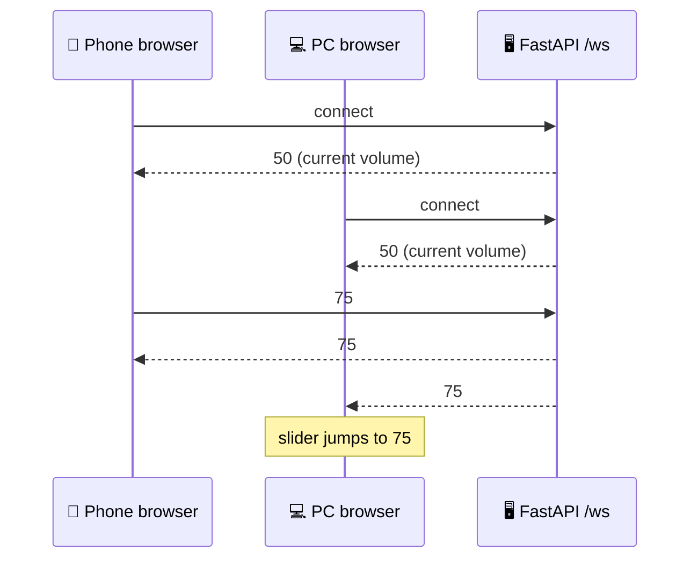

# remote-volume-control

Control your computer's audio volume from any device on the same network — no app required. Open it on your phone, tablet, or another machine and the slider syncs in real time across every connected client.

> **Part of a three-repo project.** Backend: [`remote-volume-control-api`](https://github.com/kayki-araujo/remote-volume-control-api) · Deployment: [`remote-volume-control-docker`](https://github.com/kayki-araujo/remote-volume-control-docker)

---

## Demo

<video src="https://raw.githubusercontent.com/kayki-araujo/remote-volume-control/main/.docs/horizontal.mp4" autoplay loop muted playsinline></video>

*Portrait and landscape layouts adapt automatically to device orientation.*

---

## Tech stack


---

## How it works

The `useVolumeSync` hook opens a persistent WebSocket connection to the backend. Every slider move or button tap sends the new integer value over the socket. The hook also listens for incoming messages, so if another device changes the volume t`he interface updates immediately — no polling, no page refresh.



The UI renders two separate layouts — portrait and landscape — and CSS hides the one that doesn't match the current orientation. On portrait devices the range slider is rendered vertically; on landscape it runs horizontally.

---

## Running locally

```bash
bun install
bun run dev
```

The app connects to `ws://<current-host>/ws`. For local development, start an instance of [`remote-volume-control-api`](https://github.com/kayki-araujo/remote-volume-control-api) on the same machine; Vite's dev server will share the same origin automatically.

---

## Project layout

```
src/
├── app.tsx               # Root component, responsive layout switching
├── hooks/
│   └── useVolumeSync.ts  # WebSocket hook — sends and receives volume state
├── index.css             # Tailwind + IBM Plex Mono
└── main.tsx              # Entry point
```

---

## Related repositories

| Repository | Description |
|---|---|
| [`remote-volume-control-api`](https://github.com/kayki-araujo/remote-volume-control-api) | FastAPI WebSocket server, controls system volume via `pactl` |
| [`remote-volume-control-docker`](https://github.com/kayki-araujo/remote-volume-control-docker) | Single-container deployment — nginx + uvicorn + GitHub Actions CI |